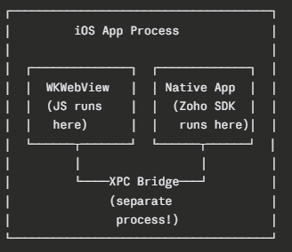
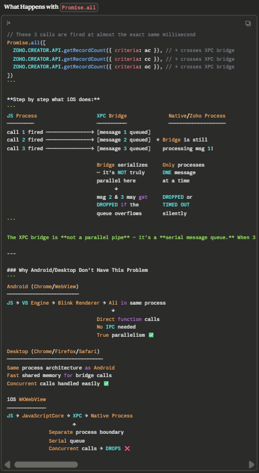
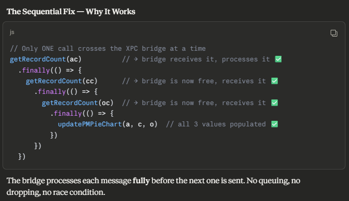

## Wohr Parking Quatation Widgets!

### iOS Issue [Occurs in Sales Representative and Regional Head]
-------------------------

#### Why Promise.all Fails on iOS WKWebView
The Architecture Difference
On Android/Desktop, the browser's JavaScript engine and the native app communicate in the same process or via a fast shared memory bridge.
On iOS, Apple forces all apps to use WKWebView — and it has a fundamentally different architecture:  
  

WKWebView runs JavaScript in a completely separate process from the native app. Every single API call has to cross this XPC (Inter-Process Communication) bridge.  

  

  
